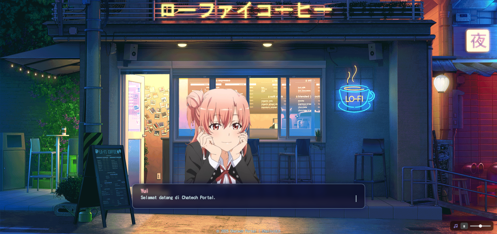

# 🌸 Web Portal VN Style


> Web interaktif bergaya *visual novel* — versi publik, tanpa menu rahasia.

---

## ✨ Fitur

- 🎭 Animasi karakter dengan efek melayang (*float animation*)  
- 💬 Kotak dialog dengan efek *typewriter*  
- 🎶 Musik latar lengkap dengan kontrol play/pause & pengaturan volume  
- 📱 Desain responsif, cocok untuk desktop & mobile  

---

## 🚀 Cara Menjalankan

  ```bash
  # Clone repository
  git clone https://github.com/ibsgnxxx/web-portal-vn-style.git
  
  # Masuk ke direktori proyek
  cd web-portal-vn-style
  
  # Buka file index.html di browser (double-click)
  # Tidak membutuhkan server atau setup tambahan
```
## 📸 Preview


🛠️ Cara Kontribusi
  ```bash
    # 1. Fork repo ini
    
    # 2. Buat branch baru
    git checkout -b fitur-baru
    
    # 3. Lakukan perubahan lalu commit
    git commit -m "Tambah fitur baru"
    
    # 4. Push ke branch di fork
    git push origin fitur-baru
    
    # 5. Buka Pull Request ke repo utama
```
📜 Lisensi

Proyek ini dilisensikan di bawah MIT License — silakan gunakan, modifikasi, dan distribusikan ulang dengan menyertakan lisensi ini.

© 2025 Chairuldjt
